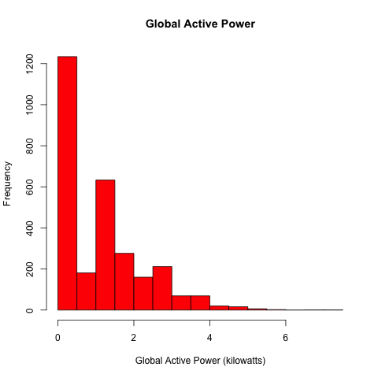
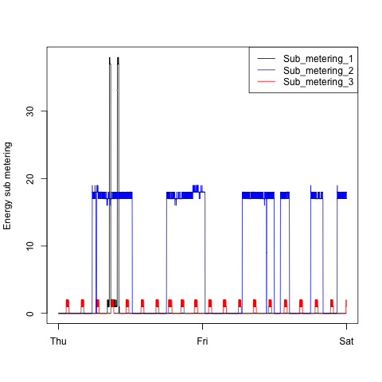

### Description

This repository contains the data, code, and plots for Project 1 in the Exploratory Data Analysis course.

### Running Code

You can run this code by executing these high level steps.

##### 1) Clone this repository to your local environment

##### 2A) OPTIONAL: Download the compressed data zip file and unzip the file in the top level directory of your repository

Download Link: https://d396qusza40orc.cloudfront.net/exdata%2Fdata%2Fhousehold_power_consumption.zip

You can run the R plotting code which reads a small dataset which contains only the data applicable to the plots (Feb 1 2007 to Feb 2 2007).

Alternatively you can download the raw data and execute `plot0_reader.R` that subsets and prepares the data used to generate the R plots.  That data is saved to `dumpdata.R` and is read by each plotting script.

##### 2B) OPTIONAL: Run `plot0_reader.R` to produce the subsetted plot data including required data transformations

If you executed Step 2A and would like to process the raw machine data, execute script `plot0_reader.R` which will replace `dumpdata.R`.

NOTE: There is no need to execute Step 2A & 2B unless desired.  Each plotting script (`plot1.R`, `plot2.R`, `plot3.R`, `plot4.R`) will read `dumpdata.R` included in this repository.

##### 3) Execute each plotting script to generate their respective plots

* `Rscript plot1.R`
* `Rscript plot2.R`
* `Rscript plot3.R`
* `Rscript plot4.R`

### Plot 1

### Plot 2

### Plot 3

### Plot 4

